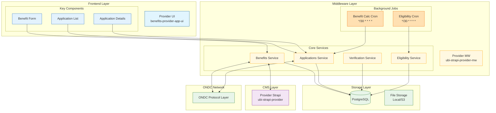
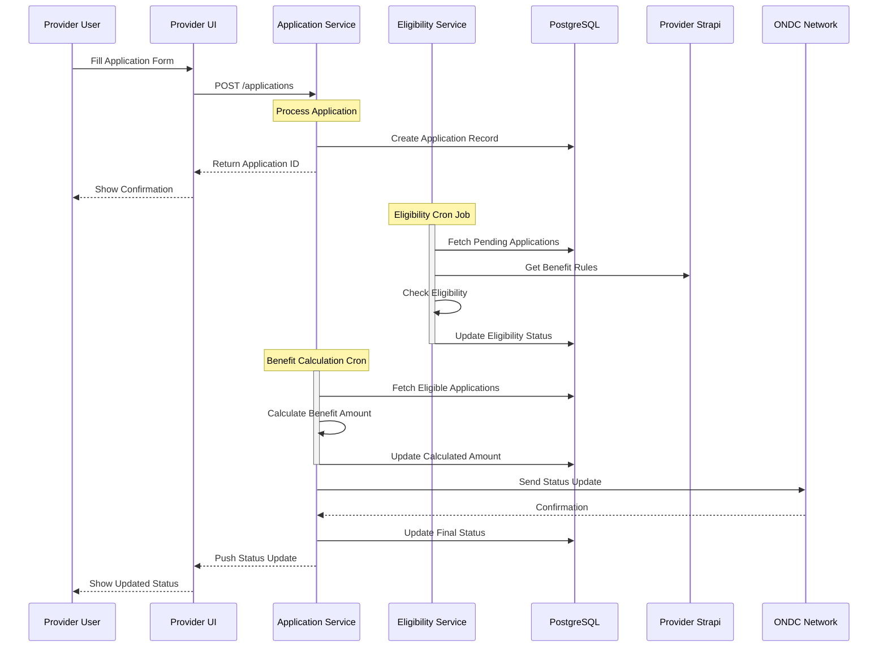
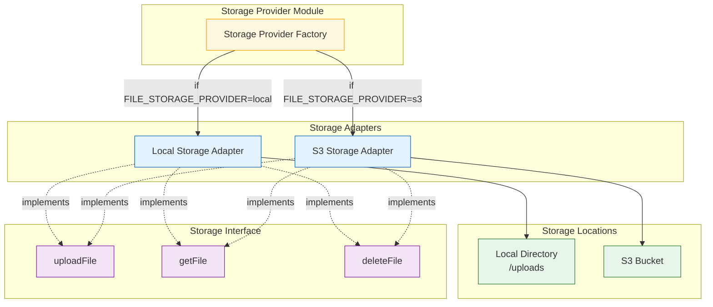
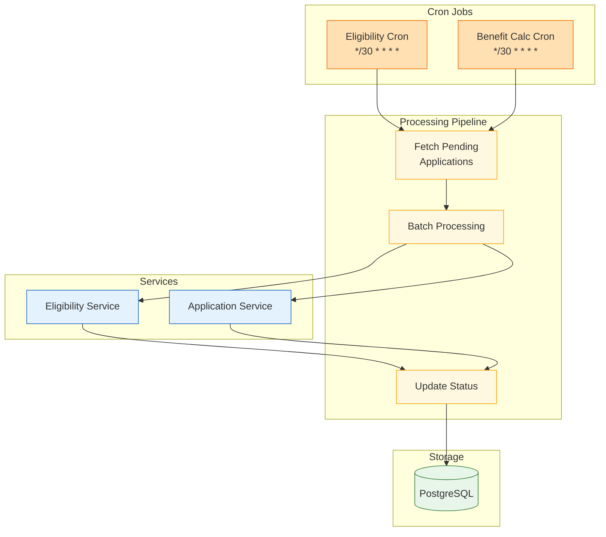

# Architecture Diagrams

This document provides a comprehensive overview of the Provider system architecture, focusing on application processing, storage systems, and background processes.

## High-Level System Architecture

## Application Processing Flow

## Storage System Architecture

## Background Job Processes

### Component Descriptions

1. **Application Processing**:
   - Form submission through UI
   - Application record creation
   - Status tracking and updates
   - ONDC protocol integration

2. **Storage System**:
   - Configurable storage provider (local/S3)
   - Unified interface for file operations
   - Metadata storage in PostgreSQL
   - Secure file handling

3. **Background Jobs**:
   - Scheduled eligibility checks (every 30 minutes)
   - Automated benefit calculations (every 30 minutes)
   - Batch processing for efficiency
   - Status updates and notifications

### Key Processes

1. **Application Submission**:
   - Form data validation
   - Application record creation
   - Initial status assignment

2. **Background Processing**:
   - Eligibility verification
   - Benefit amount calculation
   - Status updates
   - ONDC protocol compliance

3. **Storage Operations**:
   - File upload handling
   - Metadata management
   - Storage provider selection
   - Error handling and recovery