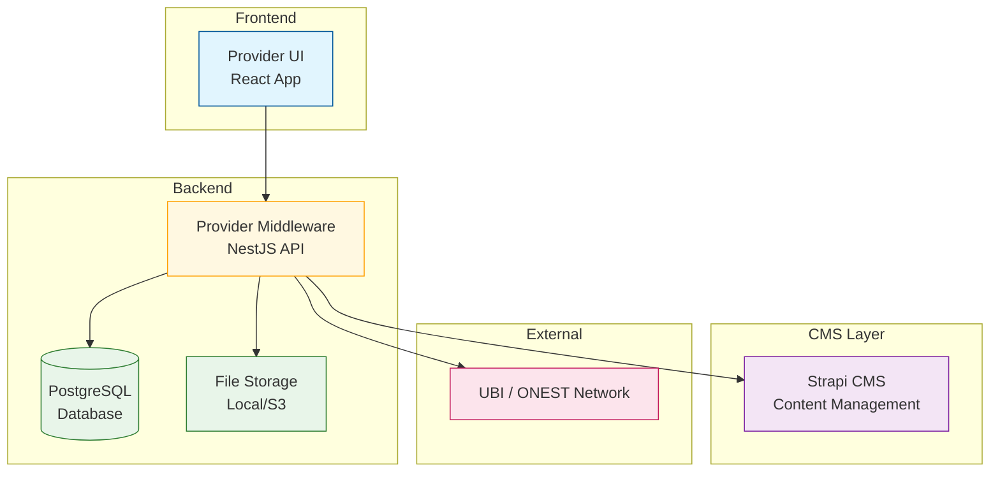
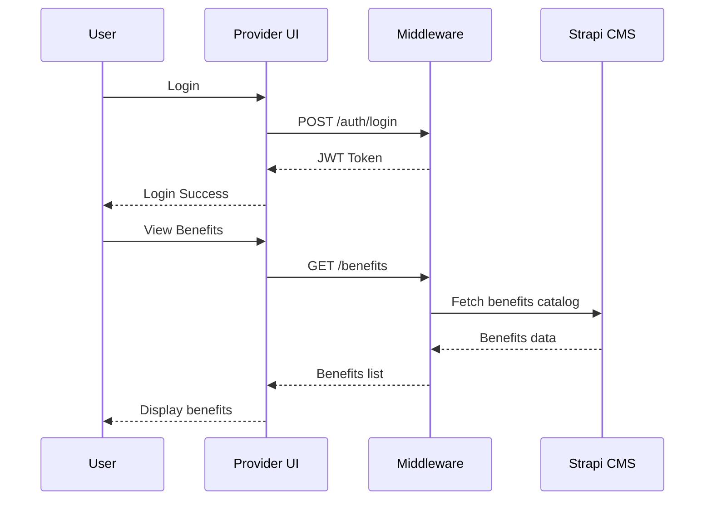
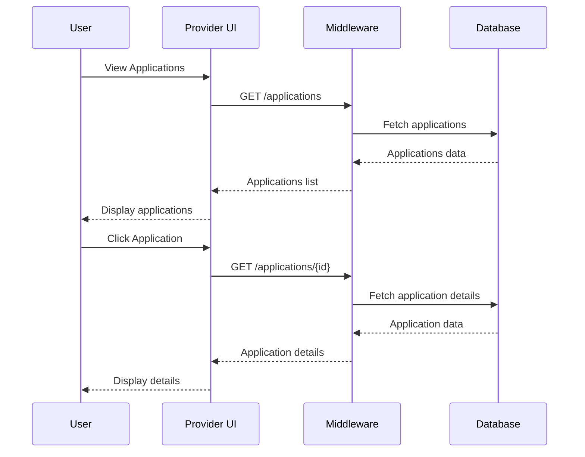
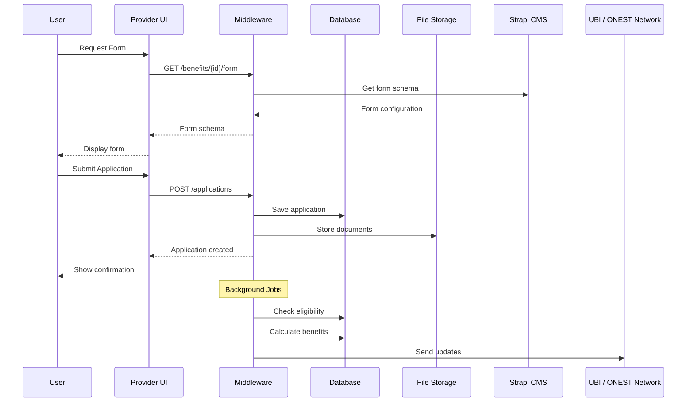
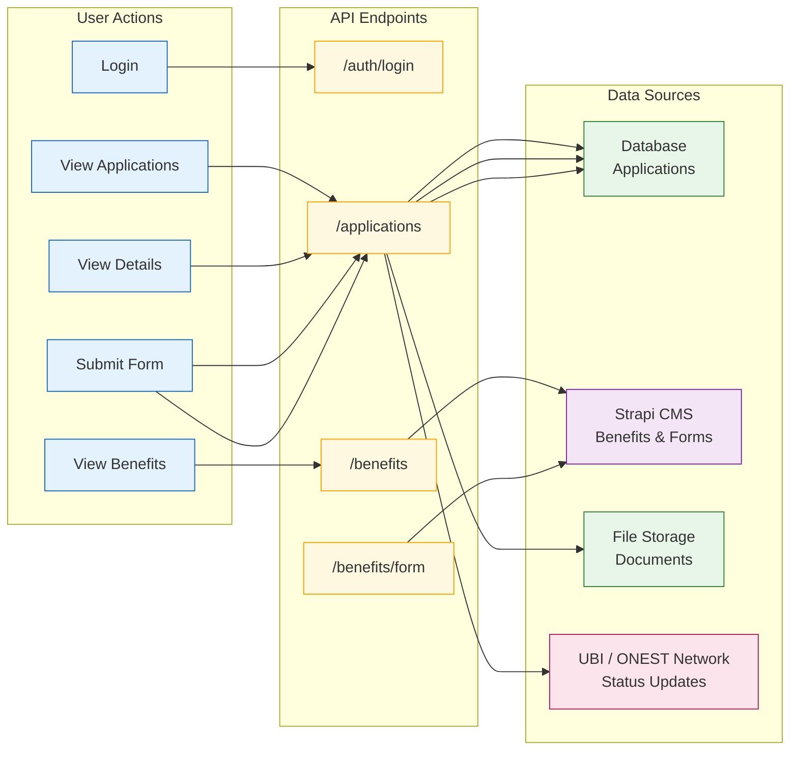

# Provider System - Architecture Diagrams

This document provides a simple overview of the UBI Provider system architecture with three essential diagrams.

## System Overview

The UBI Provider system enables providers to manage benefit applications through ONDC protocol. It consists of three main parts:

- **Provider UI**: React frontend for providers
- **Provider Middleware**: NestJS backend handling business logic  
- **Provider CMS**: Strapi CMS for content management

## 1. High-Level Architecture Diagram

## 2. Sequence Diagrams

### 2.1 Login and View Benefits

### 2.2 View Applications and Application Details

### 2.3 Application Form Submission and Processing

## 3. Data Flow Diagram

## Key Features

### Frontend (Provider UI)
- Login and authentication
- View available benefits
- View submitted applications
- View application details
- Submit new applications

### Backend (Provider Middleware)
- JWT authentication
- CRUD operations for applications
- File storage management
- Background processing (eligibility & calculations)
- ONDC protocol integration

### CMS (Strapi)
- Benefit configurations
- Form schemas
- Content management

### Background Processing
- Eligibility checking (every 30 minutes)
- Benefit amount calculations (every 30 minutes)
- Document verification
- Status updates to ONDC

This simplified architecture focuses on the core user flows and system interactions that are essential for understanding how the provider system works.