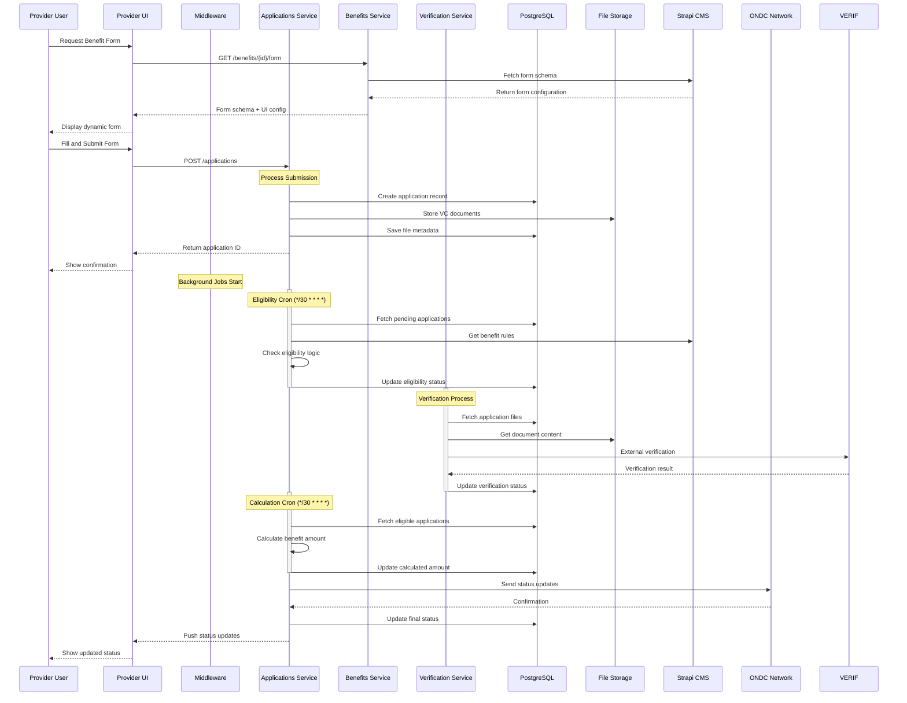
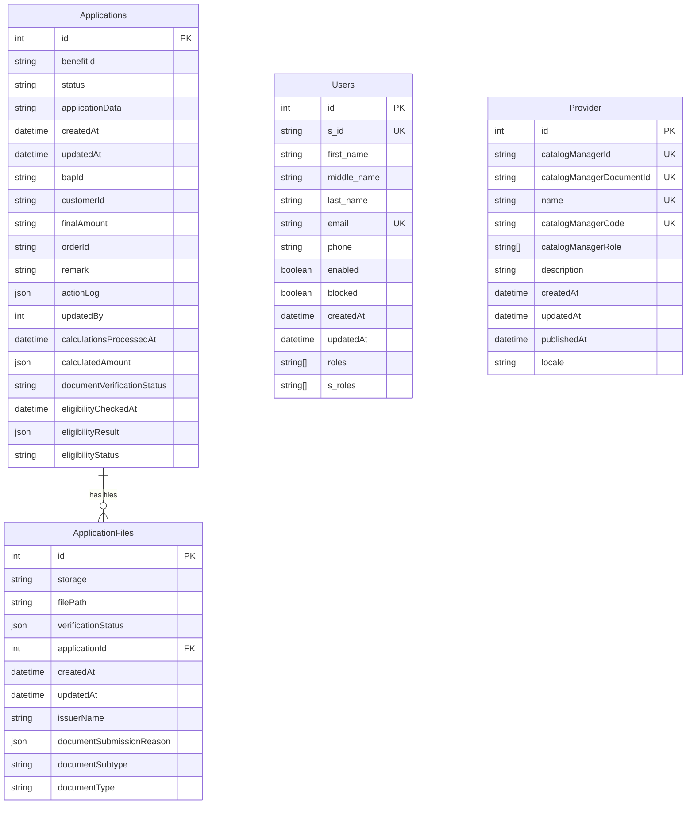
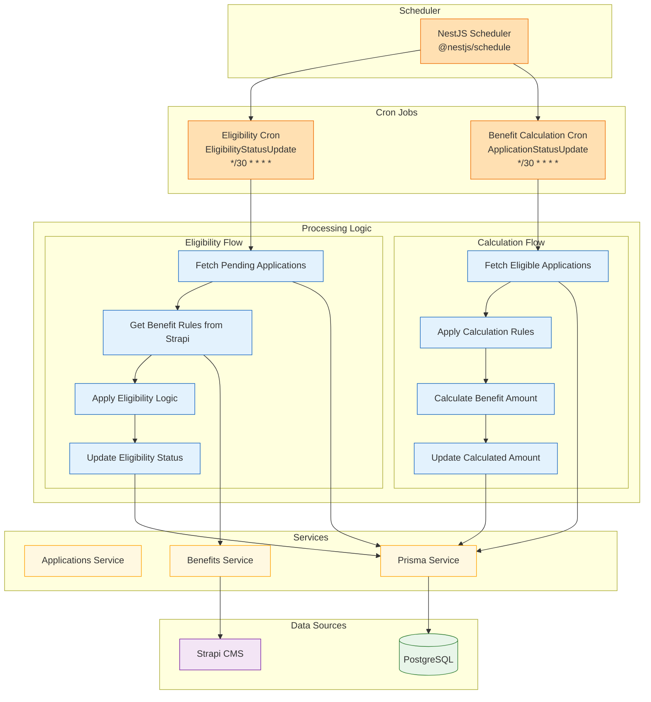

# Provider System - Comprehensive Architecture Guide

This document provides a complete overview of the UBI Provider system architecture. It includes visual representations of system components, data flows, and processes to help new team members understand the entire system.

## System Overview

The UBI Provider system is a comprehensive platform that enables providers to manage benefit applications through ONDC protocol. It consists of three main repositories:

- **benefits-provider-app-ui**: React frontend for providers
- **ubi-strapi-provider-mw**: NestJS middleware handling business logic
- **ubi-strapi-provider**: Strapi CMS for content management

## High-Level System Architecture

```mermaid
graph TB
    subgraph "Frontend Layer"
        UI[Provider UI<br/>benefits-provider-app-ui<br/>React Application]
        subgraph "UI Components"
            BL[Benefit List View]
            AF[Application Form]
            AL[Application List]
            AD[Application Details]
            DV[Document Viewer]
        end
        style UI fill:#e1f5fe,stroke:#01579b
        style BL fill:#e3f2fd,stroke:#1565c0
        style AF fill:#e3f2fd,stroke:#1565c0
        style AL fill:#e3f2fd,stroke:#1565c0
        style AD fill:#e3f2fd,stroke:#1565c0
        style DV fill:#e3f2fd,stroke:#1565c0
    end

    subgraph "Middleware Layer"
        MW[Provider Middleware<br/>ubi-strapi-provider-mw<br/>NestJS Application]
        
        subgraph "Core Modules"
            AUTH[Auth Module<br/>JWT Authentication]
            BEN[Benefits Module<br/>ONDC Integration]
            APP[Applications Module<br/>Lifecycle Management]
            FILES[ApplicationFiles Module<br/>Document Handling]
            VER[Verifications Module<br/>Document Verification]
            ADMIN[Strapi Admin Module<br/>User Management]
        end
        
        subgraph "Background Jobs"
            EC[Eligibility Cron<br/>Every 30 minutes]
            BC[Benefit Calculation Cron<br/>Every 30 minutes]
        end
        
        subgraph "Storage System"
            SP[Storage Provider<br/>Factory Pattern]
            LSA[Local Storage<br/>Adapter]
            S3A[S3 Storage<br/>Adapter]
        end
        
        style MW fill:#fff8e1,stroke:#ffa000
        style AUTH fill:#fff8e1,stroke:#ffa000
        style BEN fill:#fff8e1,stroke:#ffa000
        style APP fill:#fff8e1,stroke:#ffa000
        style FILES fill:#fff8e1,stroke:#ffa000
        style VER fill:#fff8e1,stroke:#ffa000
        style ADMIN fill:#fff8e1,stroke:#ffa000
        style EC fill:#ffe0b2,stroke:#ef6c00
        style BC fill:#ffe0b2,stroke:#ef6c00
        style SP fill:#f3e5f5,stroke:#7b1fa2
        style LSA fill:#f3e5f5,stroke:#7b1fa2
        style S3A fill:#f3e5f5,stroke:#7b1fa2
    end

    subgraph "Database Layer"
        DB[(PostgreSQL<br/>Applications & Files)]
        subgraph "Main Tables"
            APPS[Applications]
            APPFILES[ApplicationFiles]
            USERS[Users]
            PROVIDERS[Providers]
        end
        style DB fill:#e8f5e9,stroke:#2e7d32
        style APPS fill:#e8f5e9,stroke:#2e7d32
        style APPFILES fill:#e8f5e9,stroke:#2e7d32
        style USERS fill:#e8f5e9,stroke:#2e7d32
        style PROVIDERS fill:#e8f5e9,stroke:#2e7d32
    end

    subgraph "File Storage"
        FS[File Storage<br/>Configurable]
        LOCAL[Local Directory<br/>/uploads]
        S3[AWS S3<br/>Bucket]
        style FS fill:#e8f5e9,stroke:#2e7d32
        style LOCAL fill:#e8f5e9,stroke:#2e7d32
        style S3 fill:#e8f5e9,stroke:#2e7d32
    end

    subgraph "CMS Layer"
        CMS[Provider Strapi<br/>ubi-strapi-provider<br/>Content Management]
        subgraph "Content Types"
            BENEFITS[Benefits Configuration]
            FORMS[Form Schemas]
            CONTENT[Static Content]
        end
        style CMS fill:#f3e5f5,stroke:#7b1fa2
        style BENEFITS fill:#f3e5f5,stroke:#7b1fa2
        style FORMS fill:#f3e5f5,stroke:#7b1fa2
        style CONTENT fill:#f3e5f5,stroke:#7b1fa2
    end

    subgraph "External Services"
        ONDC[ONDC Network<br/>Protocol Layer]
        SENTRY[Sentry<br/>Error Monitoring]
        VERIF[Verification Service<br/>Document Validation]
        style ONDC fill:#e8f5e9,stroke:#2e7d32
        style SENTRY fill:#fce4ec,stroke:#c2185b
        style VERIF fill:#fce4ec,stroke:#c2185b
    end

    %% Frontend to Middleware
    BL --> BEN
    AF --> APP
    AL --> APP
    AD --> APP
    DV --> FILES

    %% Middleware Internal
    APP --> EC
    APP --> BC
    FILES --> SP
    SP --> LSA
    SP --> S3A
    VER --> SP

    %% Middleware to Database
    AUTH --> DB
    BEN --> DB
    APP --> DB
    FILES --> DB
    VER --> DB
    ADMIN --> DB

    %% Middleware to Storage
    LSA --> LOCAL
    S3A --> S3

    %% Middleware to CMS
    BEN --> CMS
    APP --> CMS
    ADMIN --> CMS

    %% Middleware to External Services
    BEN --> ONDC
    APP --> ONDC
    VER --> VERIF
    MW --> SENTRY
```



## Application Processing Flow

This diagram shows the complete lifecycle of an application from submission to completion:



## Database Schema and Relationships



## Storage System Architecture

```mermaid
graph TB
    subgraph "Application Layer"
        APP[Applications Service]
        FILES[ApplicationFiles Service]
        VER[Verification Service]
        style APP fill:#fff8e1,stroke:#ffa000
        style FILES fill:#fff8e1,stroke:#ffa000
        style VER fill:#fff8e1,stroke:#ffa000
    end

    subgraph "Storage Abstraction"
        INTERFACE[IFileStorageService<br/>Interface]
        FACTORY[Storage Provider Factory<br/>Dynamic Selection]
        style INTERFACE fill:#f3e5f5,stroke:#7b1fa2
        style FACTORY fill:#f3e5f5,stroke:#7b1fa2
    end

    subgraph "Storage Adapters"
        LOCAL_ADAPTER[Local Storage Adapter<br/>File System Operations]
        S3_ADAPTER[S3 Storage Adapter<br/>AWS SDK Integration]
        style LOCAL_ADAPTER fill:#e3f2fd,stroke:#1565c0
        style S3_ADAPTER fill:#e3f2fd,stroke:#1565c0
    end

    subgraph "Storage Destinations"
        LOCAL_DIR[Local Directory<br/>/uploads/{applicationId}/]
        S3_BUCKET[AWS S3 Bucket<br/>Configurable Prefix]
        style LOCAL_DIR fill:#e8f5e9,stroke:#2e7d32
        style S3_BUCKET fill:#e8f5e9,stroke:#2e7d32
    end

    subgraph "Configuration"
        ENV[Environment Variables<br/>FILE_STORAGE_PROVIDER]
        style ENV fill:#ffe0b2,stroke:#ef6c00
    end

    APP --> FACTORY
    FILES --> FACTORY
    VER --> FACTORY
    
    FACTORY --> INTERFACE
    INTERFACE -.->|implements| LOCAL_ADAPTER
    INTERFACE -.->|implements| S3_ADAPTER
    
    ENV -->|local| LOCAL_ADAPTER
    ENV -->|s3| S3_ADAPTER
    
    LOCAL_ADAPTER --> LOCAL_DIR
    S3_ADAPTER --> S3_BUCKET

    %% Operations
    subgraph "Storage Operations"
        UPLOAD[uploadFile]
        GET[getFile]
        DELETE[deleteFile]
        style UPLOAD fill:#f3e5f5,stroke:#7b1fa2
        style GET fill:#f3e5f5,stroke:#7b1fa2
        style DELETE fill:#f3e5f5,stroke:#7b1fa2
    end

    INTERFACE --> UPLOAD
    INTERFACE --> GET
    INTERFACE --> DELETE
```

## Background Job Processes



## API Endpoints and Module Structure

```mermaid
graph LR
    subgraph "API Endpoints"
        AUTH_EP[/auth/*<br/>Authentication]
        BEN_EP[/benefits/*<br/>Benefits Management]
        APP_EP[/applications/*<br/>Application Management]
        FILES_EP[/application-files/*<br/>File Management]
        VER_EP[/verification/*<br/>Document Verification]
        ADMIN_EP[/strapi-admin/*<br/>Admin Management]
        style AUTH_EP fill:#e3f2fd,stroke:#1565c0
        style BEN_EP fill:#e3f2fd,stroke:#1565c0
        style APP_EP fill:#e3f2fd,stroke:#1565c0
        style FILES_EP fill:#e3f2fd,stroke:#1565c0
        style VER_EP fill:#e3f2fd,stroke:#1565c0
        style ADMIN_EP fill:#e3f2fd,stroke:#1565c0
    end

    subgraph "Controllers"
        AUTH_CTRL[AuthController]
        BEN_CTRL[BenefitsController]
        APP_CTRL[ApplicationsController]
        FILES_CTRL[ApplicationFilesController]
        VER_CTRL[VerificationController]
        ADMIN_CTRL[StrapiAdminController]
        style AUTH_CTRL fill:#fff8e1,stroke:#ffa000
        style BEN_CTRL fill:#fff8e1,stroke:#ffa000
        style APP_CTRL fill:#fff8e1,stroke:#ffa000
        style FILES_CTRL fill:#fff8e1,stroke:#ffa000
        style VER_CTRL fill:#fff8e1,stroke:#ffa000
        style ADMIN_CTRL fill:#fff8e1,stroke:#ffa000
    end

    subgraph "Services"
        AUTH_SRV[AuthService]
        BEN_SRV[BenefitsService]
        APP_SRV[ApplicationsService]
        FILES_SRV[ApplicationFilesService]
        VER_SRV[VerificationService]
        ADMIN_SRV[StrapiAdminService]
        style AUTH_SRV fill:#f3e5f5,stroke:#7b1fa2
        style BEN_SRV fill:#f3e5f5,stroke:#7b1fa2
        style APP_SRV fill:#f3e5f5,stroke:#7b1fa2
        style FILES_SRV fill:#f3e5f5,stroke:#7b1fa2
        style VER_SRV fill:#f3e5f5,stroke:#7b1fa2
        style ADMIN_SRV fill:#f3e5f5,stroke:#7b1fa2
    end

    AUTH_EP --> AUTH_CTRL --> AUTH_SRV
    BEN_EP --> BEN_CTRL --> BEN_SRV
    APP_EP --> APP_CTRL --> APP_SRV
    FILES_EP --> FILES_CTRL --> FILES_SRV
    VER_EP --> VER_CTRL --> VER_SRV
    ADMIN_EP --> ADMIN_CTRL --> ADMIN_SRV
```

## Key Features and Components

### 1. **Application Processing**
- Dynamic form generation from Strapi CMS
- VC document handling with base64 encoding
- Application lifecycle management
- Status tracking and updates

### 2. **Background Processing**
- **Eligibility Checking**: Automated eligibility verification every 30 minutes
- **Benefit Calculation**: Automated benefit amount calculation
- **Batch Processing**: Configurable batch sizes for performance

### 3. **Storage System**
- **Flexible Storage**: Support for both local and S3 storage
- **Factory Pattern**: Dynamic storage provider selection
- **Unified Interface**: Consistent API across storage types

### 4. **Security & Authentication**
- JWT-based authentication
- Strapi admin integration
- Role-based access control
- Request validation and sanitization

### 5. **Integration Points**
- **ONDC Protocol**: Complete integration for benefit discovery and transactions
- **Strapi CMS**: Content management and form schema
- **External Verification**: Document verification services
- **Error Monitoring**: Sentry integration

### 6. **Database Design**
- **Applications**: Core application data and status
- **ApplicationFiles**: Document storage metadata
- **Users**: Provider user management
- **Providers**: Provider configuration

## Configuration and Environment

### Key Environment Variables
- `FILE_STORAGE_PROVIDER`: Storage type (local/s3)
- `STRAPI_URL`, `STRAPI_TOKEN`: CMS integration
- `BPP_ID`, `BPP_URI`: ONDC configuration
- `VERIFICATION_SERVICE_URL`: Document verification
- `DATABASE_URL`: PostgreSQL connection

### Deployment Considerations
- **Scalability**: Horizontal scaling with load balancers
- **Monitoring**: Sentry for error tracking
- **Storage**: Configurable for different environments
- **Cron Jobs**: Configurable schedules for background processing

This architecture provides a robust, scalable foundation for managing benefit applications through the ONDC network while maintaining flexibility and security.