# Architecture Diagrams

Visual representations of the system architecture, data flows, and component interactions.

## System Architecture

### Provider System Overview

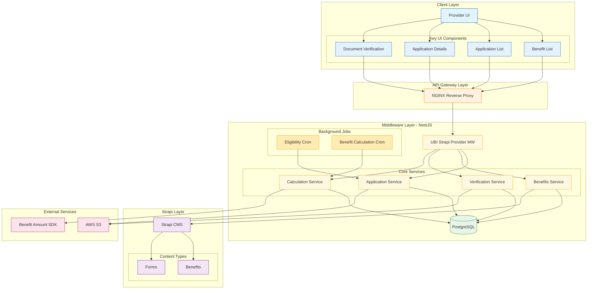

### Application Processing Flow

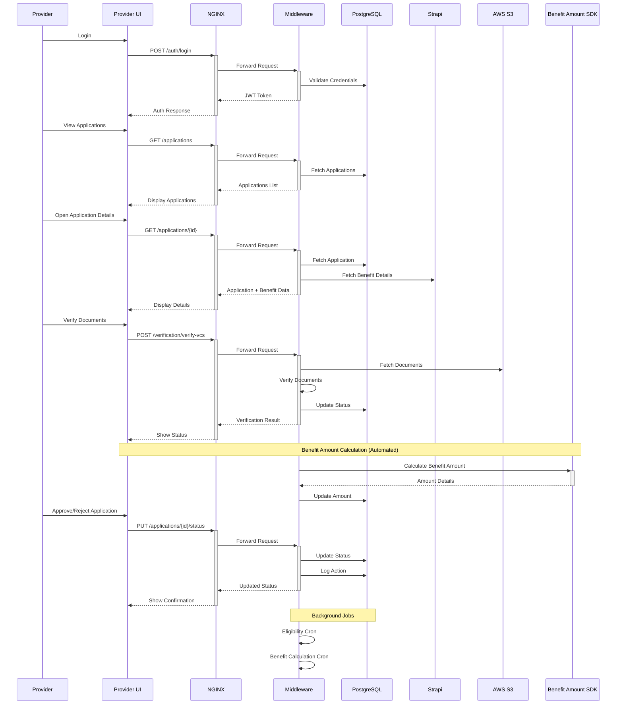

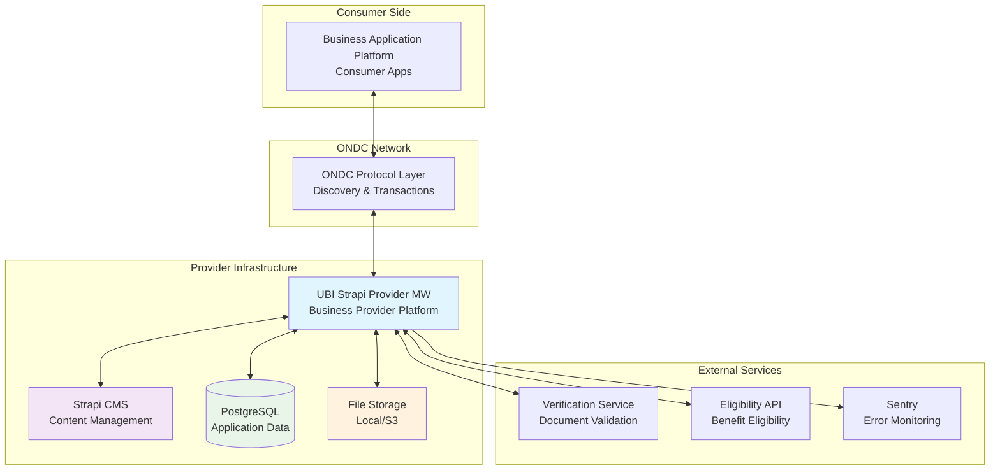

### Application Component Architecture

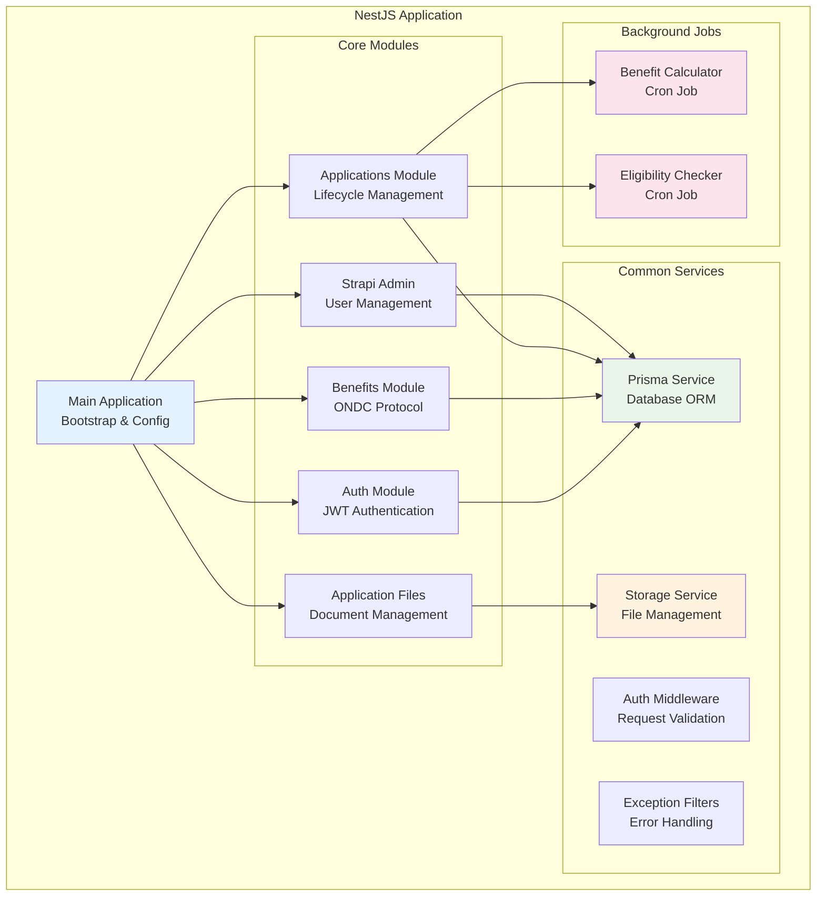

## Data Flow Diagrams

### Benefit Discovery Flow

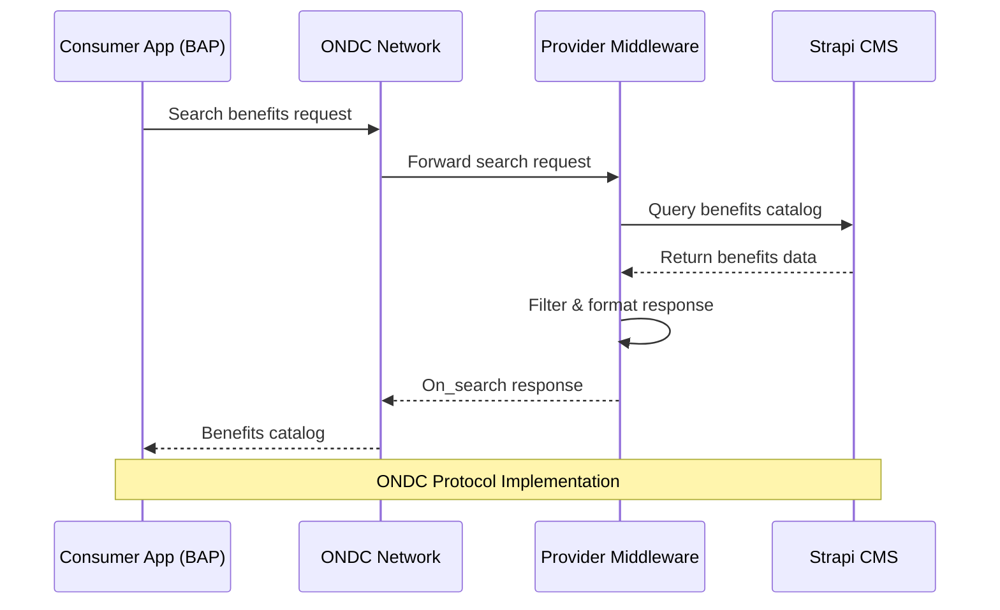

### Application Submission Flow

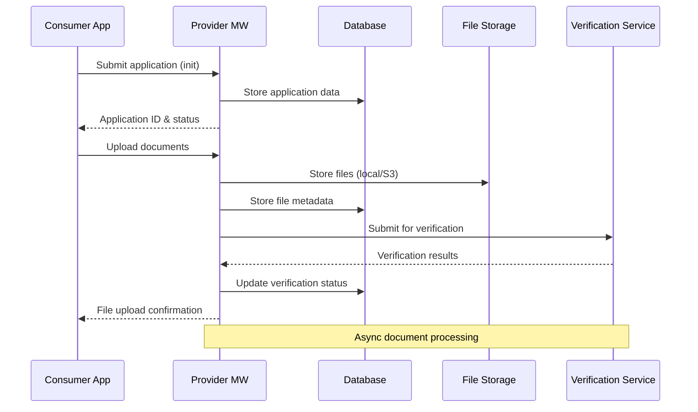

### Background Processing Flow

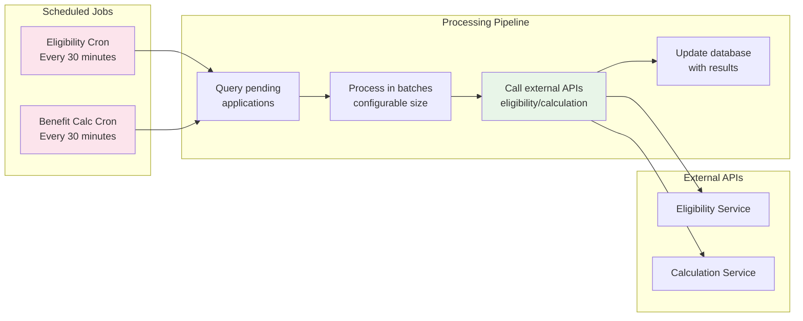

## Database Schema Diagram

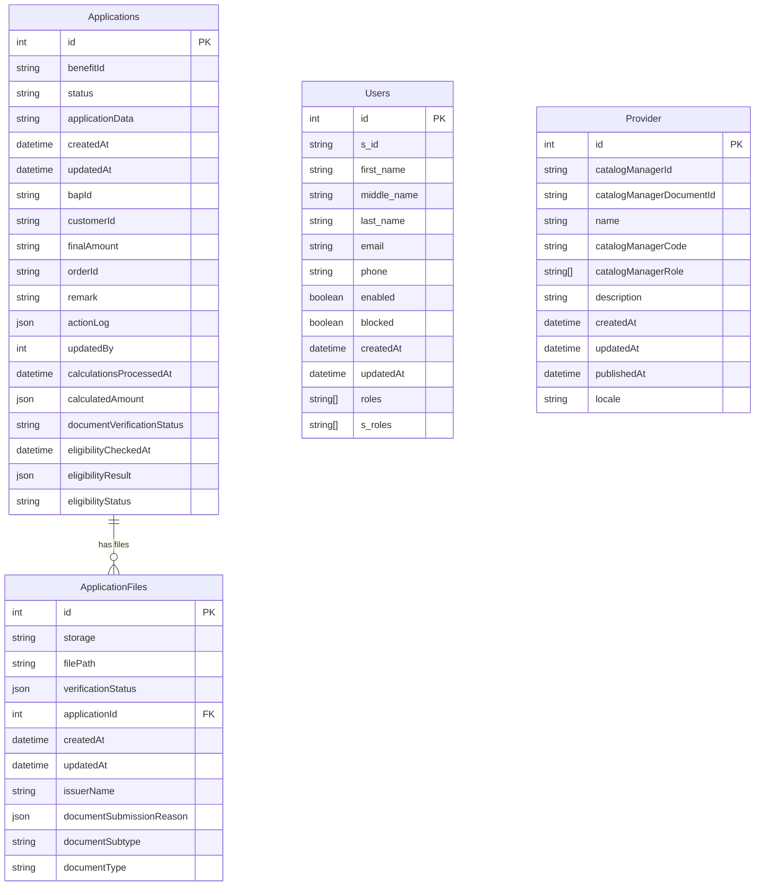

## Security Architecture

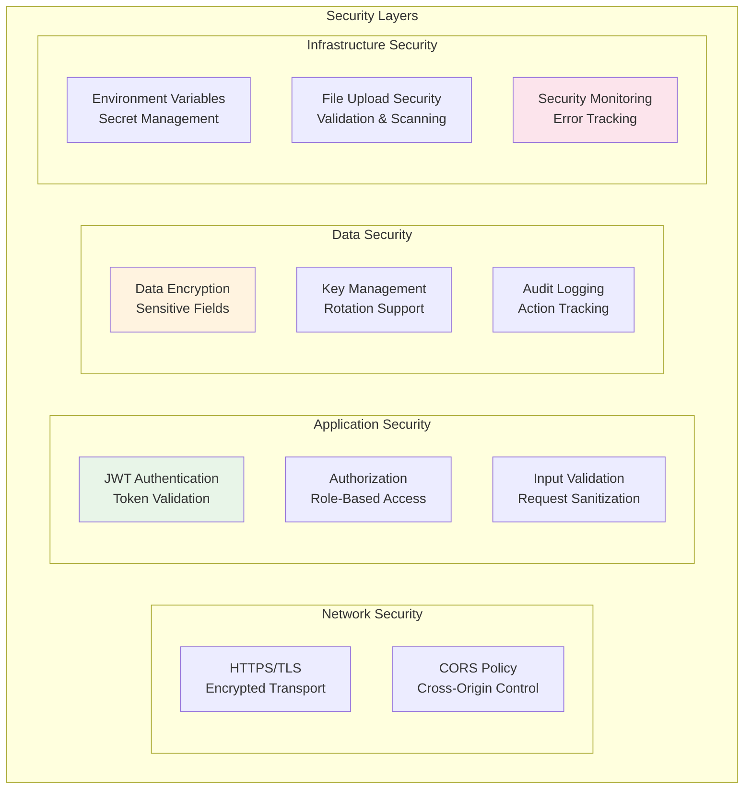

## Deployment Architecture

### Local Development

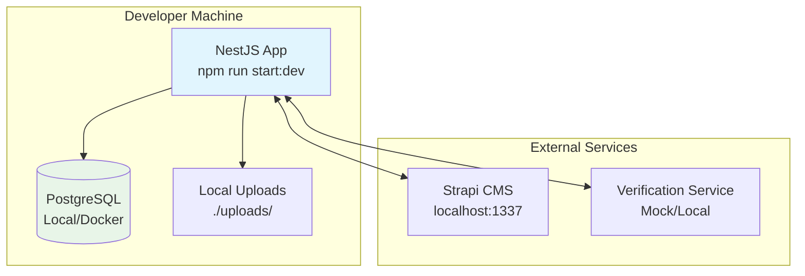

### Production Deployment

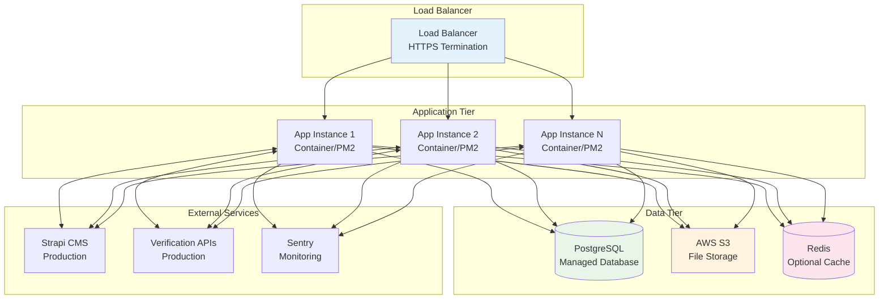

## Integration Patterns

### ONDC Protocol Flow

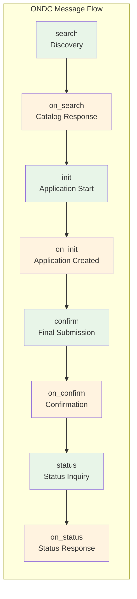

These diagrams provide a comprehensive view of the system architecture, data flows, and deployment patterns. Use them to understand component relationships and system behavior.

