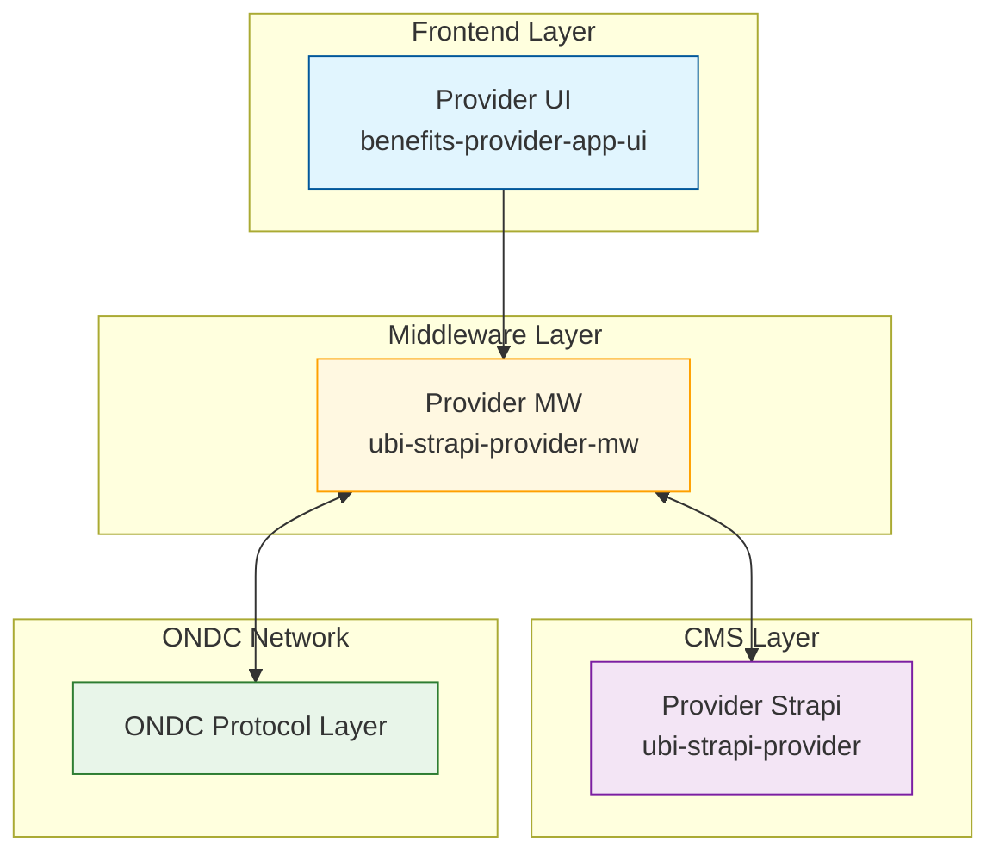
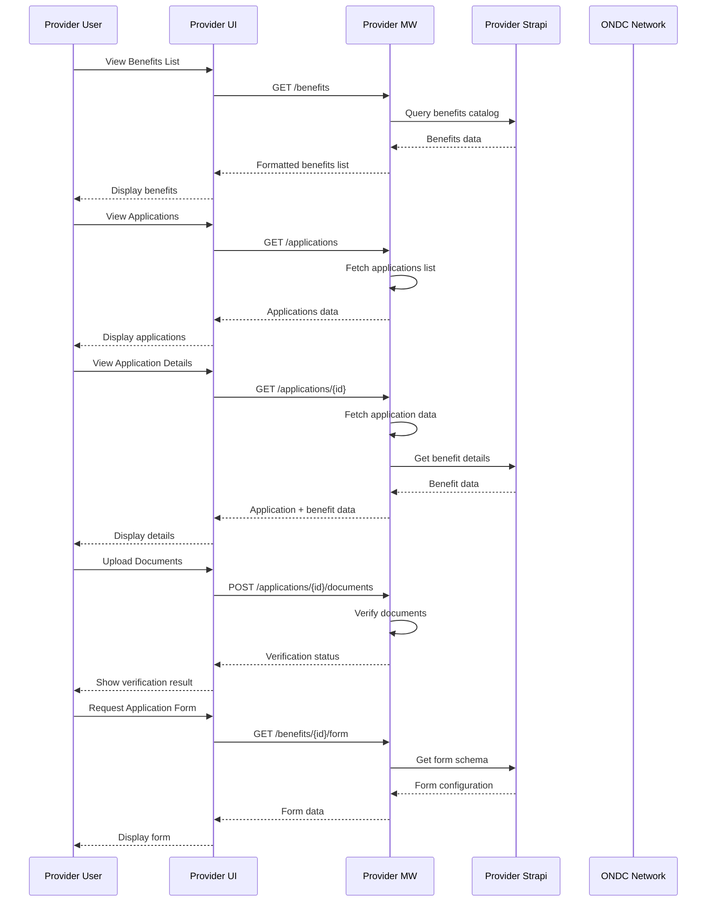
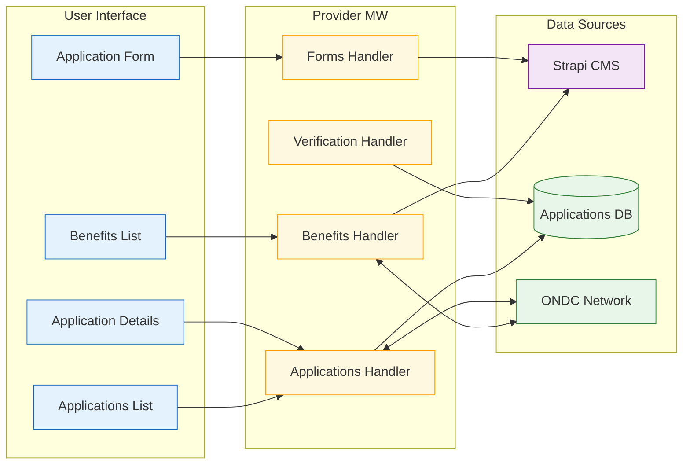

# Architecture Diagrams

This document provides a comprehensive overview of the Provider system architecture through visual diagrams. These diagrams illustrate the system components, their interactions, and key processes.

## High-Level System Architecture

The following diagram shows the main components of the Provider system and their relationships:

### Component Description

- **Provider UI (benefits-provider-app-ui)**: Frontend application that provides the user interface for providers to manage benefits and applications
- **Provider MW (ubi-strapi-provider-mw)**: Middleware service that handles business logic, data processing, and integration with ONDC
- **Provider Strapi (ubi-strapi-provider)**: CMS system that manages benefit configurations and form schemas
- **ONDC Network**: Protocol layer that enables discovery and transactions across the network

## Process Flows

The sequence diagram below illustrates the key processes in the system:

### Process Description

1. **Benefits List Flow**: Shows how providers can view available benefits
2. **Applications List Flow**: Demonstrates the process of viewing submitted applications
3. **Application Details Flow**: Details how providers can view specific application information
4. **Document Verification**: Shows the document upload and verification process
5. **Application Form**: Illustrates how application forms are fetched and displayed

## Data Flow Architecture

The following diagram shows how data flows between different components of the system:

### Data Flow Description

1. **User Interface Components**:
   - Benefits List: Displays available benefits
   - Applications List: Shows list of applications
   - Application Details: Presents detailed application information
   - Application Form: Handles form display and submission

2. **Middleware Handlers**:
   - Benefits Handler: Manages benefit-related operations
   - Applications Handler: Processes application operations
   - Verification Handler: Handles document verification
   - Forms Handler: Manages form operations

3. **Data Sources**:
   - Strapi CMS: Stores benefit and form configurations
   - Applications DB: Stores application data
   - ONDC Network: Enables network-wide operations

These diagrams provide a clear visualization of the system's architecture and its operations. They serve as a reference for understanding component interactions and data flows within the Provider system.